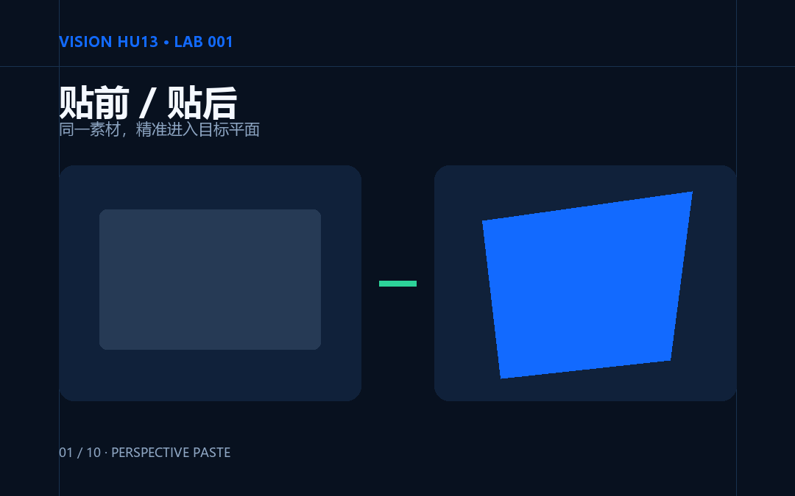

# Perspective Paste

Perspective Paste 是一个四点透视与真实融合工具：在照片中的近似平面上选择四个角，将文字或透明 PNG 贴入场景，再用亮度、环境色、纹理、模糊和混合模式减少“浮贴感”。

[在线体验](https://hub-fover.github.io/Vision-Hu13/) · [GitHub 源码](https://github.com/hub-fover/Vision-Hu13)

LAB 002 panorama-stitch scaffolding and shared contracts live in
[`lab-002/README.md`](lab-002/README.md). The root Pages experience remains
LAB 001; LAB 002 is published separately at `/Vision-Hu13/lab-002/`.

LAB 002 release verification is reproducible from the repository root:
`npm run build:lab002` stages its ignored Pages artifact at `web/lab-002/`,
then `npm run validate:lab002:release` checks cross-runtime acceptance,
real-media provenance, deterministic figures, and all staged static resources.

LAB 003 is the local three-exposure exposure-fusion lab. It is published at
[`/Vision-Hu13/lab-003/`](https://hub-fover.github.io/Vision-Hu13/lab-003/) and
keeps all three input images in the current page only. Use the packaged Peyrou
sample or select three ordinary JPEG/PNG/WebP files; the browser Worker lazy-loads
same-origin OpenCV.js and never uploads the photos.

LAB 003 release verification is reproducible with:

```powershell
npm run test:lab003
npm run test:lab003:e2e
npm run validate:lab003:release
npm run build:lab003
```

The article package, real-source manifest, technical figures and review PDF live
under [`lab-003/article/`](lab-003/article/) and [`lab-003/assets/`](lab-003/assets/).



## 功能

- Python 教学版：OpenCV 窗口交互、Pillow 文字与 PNG 图层、NumPy 几何和融合。
- 原生 Web 版：HTML、CSS、JavaScript、Canvas 2D 与 Web Worker，运行时无前端第三方依赖。
- 四点几何检查：点序、自交、近共线、面积过小、目标过细和单应矩阵稳定性。
- 消影辅助：显示两组方向线、V1/V2、画外箭头、距离提示和可见消影线。
- 六种场景参数：篮球场、楼体 Logo、墙面、海报、包装和屏幕。
- 五张真实背景、五个原创透明叠加层、十张 SVG/PNG 技术图和一组篮球场操作演示。

浏览器只在本机读取用户选择的背景、PNG 和字体；应用代码不包含用户图片上传请求。辅助线只用于编辑预览，不会进入 PNG 或 JPEG 导出。

## 快速开始

### Web

Windows 可双击仓库根目录的 `start-web.cmd`，也可以运行：

```powershell
npm ci
npm run serve
```

打开 `http://127.0.0.1:4173/`。不要直接双击 `web/index.html`，`file://` 模式会限制 ES Module、Web Worker 和本地资源加载。首次进入会加载篮球场示例并默认开启消影辅助。

### Python

支持 Python 3.11–3.12：

```powershell
py -3.12 -m venv .venv
.\.venv\Scripts\python -m pip install -e ".[dev]"
.\.venv\Scripts\python -m perspective_paste
```

不传参数时加载内置篮球场。也可以明确指定背景、透明 PNG、参数预设和输出路径：

```powershell
.\.venv\Scripts\python -m perspective_paste `
  --background assets/examples/facade.jpg `
  --asset assets/examples/facade-logo.png `
  --preset facade `
  --output facade-result.png
```

## Python 交互

| 操作 | 作用 |
|---|---|
| 鼠标左键 | 添加控制点；16px 范围内选中已有点 |
| 拖动 | 移动选中的控制点 |
| 鼠标右键 | 删除命中范围内最近点 |
| `Enter` | 确认当前有效四边形 |
| `T` | 在终端输入文字 |
| `P` | 在终端输入透明 PNG 路径 |
| `G` | 开关透视网格 |
| `V` | 开关消影辅助 |
| `M` | 循环切换 Normal、Multiply、Soft Light |
| `[` / `]` | 每次降低／提高不透明度 0.05 |
| `B` | 在 0–2.5px 间循环模糊值 |
| `S` | 按原图分辨率导出 |
| `R` | 重置控制点 |
| `Esc` | 退出 |

拖动预览最长边限制为 1200px；导出使用原图分辨率重新渲染。无效四边形不会覆盖最后一次有效预览，也不能导出。

## 跨端几何接口

点使用 `{x, y}`，四边形统一排序为 `TL → TR → BR → BL`。

| Python | Web |
|---|---|
| `order_quad` | `orderQuad` |
| `validate_quad` | `validateQuad` |
| `compute_homography` | `computeHomography` |
| `compute_vanishing_points` | `computeVanishingPoints` |
| `compute_perspective_guide` | `computePerspectiveGuide` |
| `warp_asset` | `warpAsset` |
| `blend_composite` | `blendComposite` |

固定错误码：`OUT_OF_BOUNDS`、`DUPLICATE_POINTS`、`SELF_INTERSECTION`、`NON_CONVEX`、`NEAR_COLLINEAR`、`AREA_TOO_SMALL`、`TOO_SLENDER`、`SINGULAR_HOMOGRAPHY`。

## 测试与再生成

```powershell
.\.venv\Scripts\python -m pytest
npm ci
npm run test:web
npx playwright install chromium
npm run test:e2e
.\.venv\Scripts\python scripts\validate_cross_runtime.py
```

原创叠加层、离线备用背景、技术图和篮球场演示可重复生成：

```powershell
.\.venv\Scripts\python scripts\generate_assets.py
.\.venv\Scripts\python scripts\generate_figures.py
npm run record:demo
```

从素材台账列出的 Pexels 原图重新制作真实背景：

```powershell
.\.venv\Scripts\python scripts\prepare_real_assets.py `
  --court C:\path\to\court-original.jpg `
  --facade C:\path\to\facade-original.jpg `
  --wall C:\path\to\wall-original.jpg `
  --packaging C:\path\to\packaging-original.jpg `
  --screen C:\path\to\screen-original.jpg
```

脚本按审定裁切框生成 1600×1200 派生图，并同步到 Python 和 Web 资源目录；未修改的原始大图不提交到仓库。

## 目录

```text
python/perspective_paste/  Python 包与交互入口
web/                       GitHub Pages 静态应用
shared/                    预设、错误码与跨端测试夹具
assets/examples/           示例背景与透明 PNG
docs/figures/              SVG 源图和 PNG 技术图
demo/                      篮球场 MP4、WebM 与 GIF
scripts/                   产品资产、技术图和录屏脚本
tests/                     Python、Web 与 Playwright 测试
```

## 能力边界

单应性描述近似平面到平面的映射。圆柱、衣物褶皱、曲面屏、前景遮挡、强镜面反射和复杂三维起伏，不适合只用四点透视处理。本项目不实现自动平面检测、遮挡分割、曲面变形、多图层、完整撤销、PSD 或生成式补全。

## 素材与许可

五张场景照片继续适用 Pexels License；原创叠加层、程序化备用背景和技术图采用 CC BY 4.0。逐文件作者、来源和修改方式见[素材台账](assets/SOURCES.md)与机器可读的[`asset-manifest.json`](assets/asset-manifest.json)。

- 代码：[MIT](LICENSE)
- 原创内容资产：[CC BY 4.0](LICENSE-CONTENT.md)
