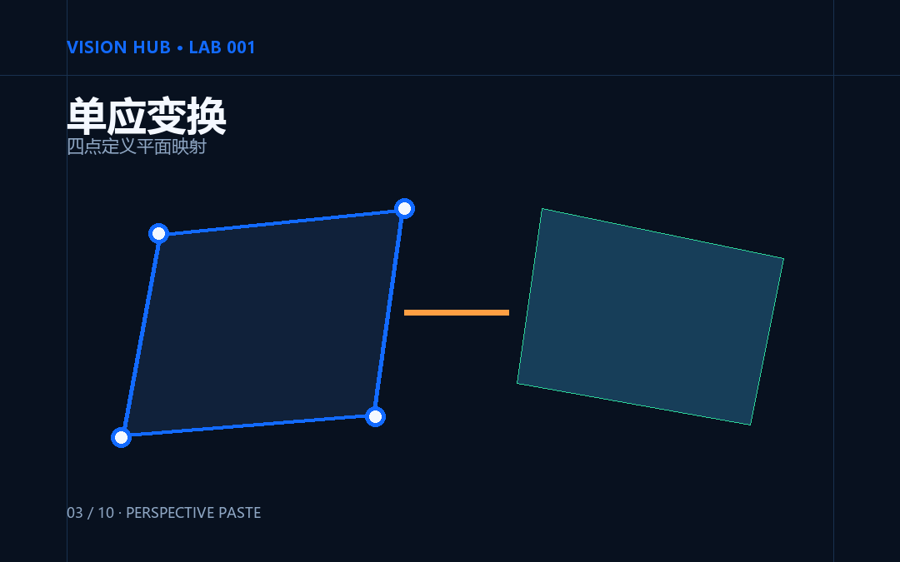
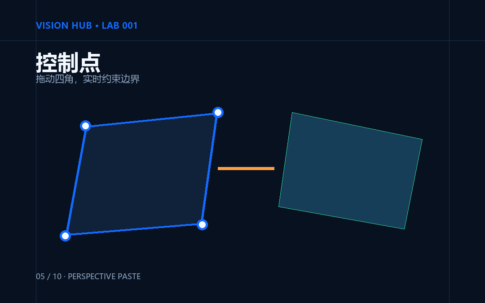
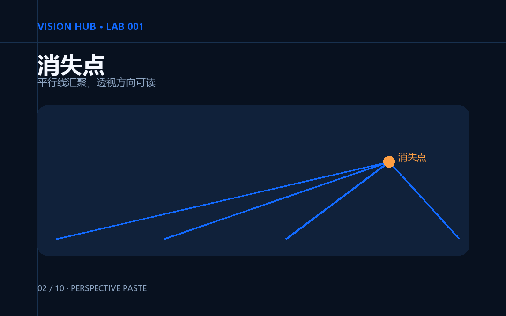
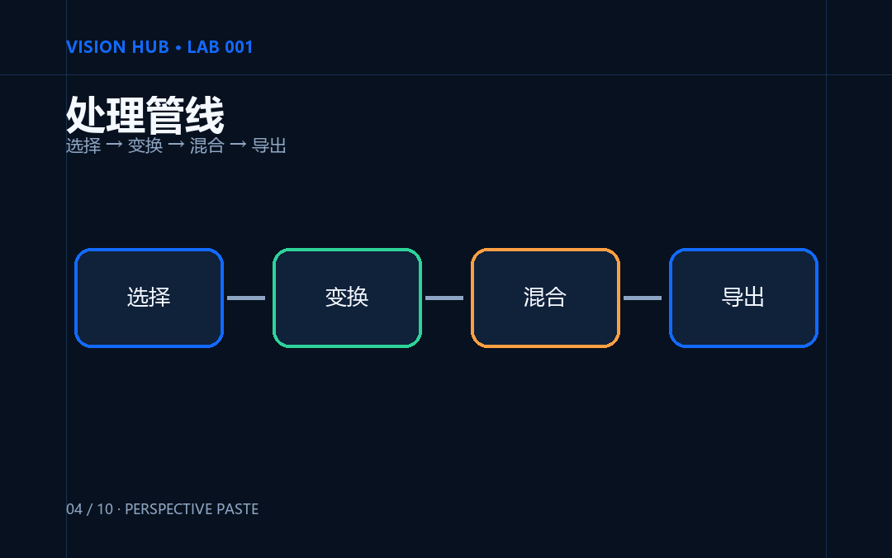
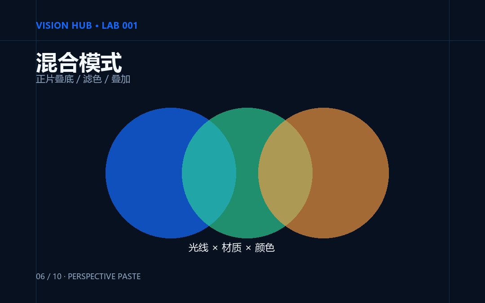
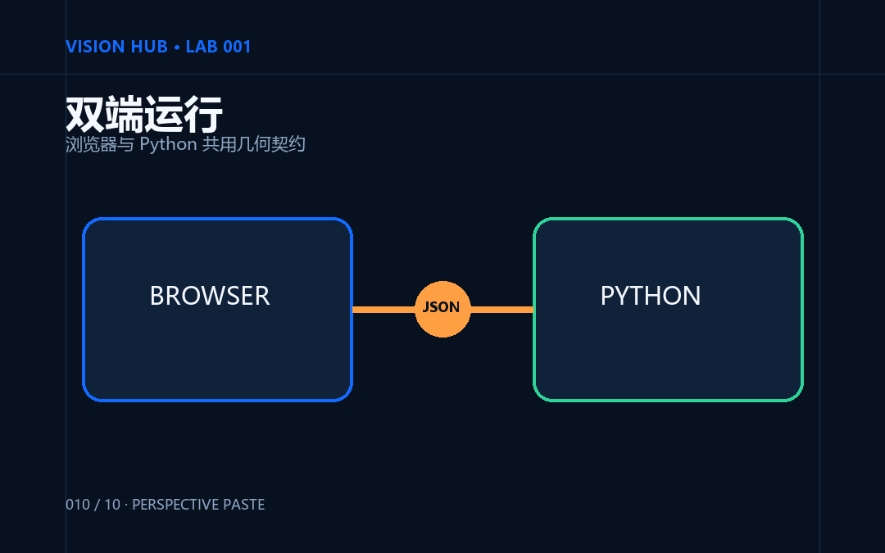
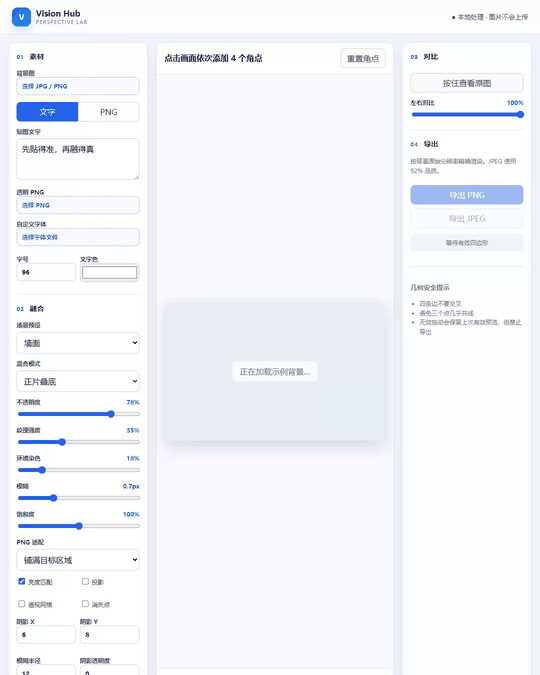
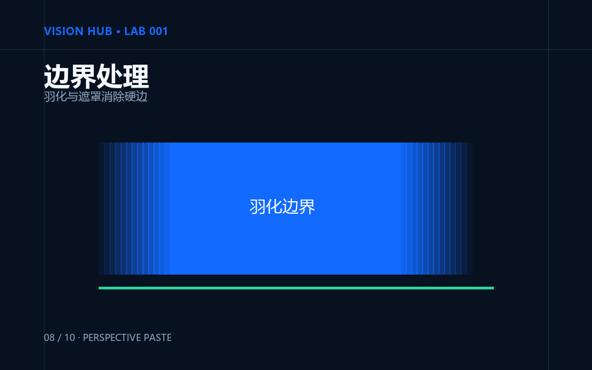

# Perspective Paste：先贴得准，再融得真

> 一张图能不能“贴进”照片，取决于两个问题：几何上是否属于那个平面，视觉上是否继承了那个环境。

把海报放到斜拍的墙上，把标识印到包装盒上，把界面替换进显示屏——这些任务看似只是“拉四个角”，结果却很容易像一张漂浮的贴纸。

这里其实混着两类问题。**透视正确**只解决“贴在哪里、边往哪里收”；**融合可信**还要回答“这里有多亮、偏什么色、纹理是否穿透、边缘该多硬、有没有阴影”。

Perspective Paste 把这两件事拆开，做成 Python 教学版和原生 Web 体验版。两端各自实现算法，共享参数语义、错误码与 JSON 测试夹具。你既可以拖动四点观察结果，也可以顺着代码看清每一步为什么存在。


## 01｜先贴得准：四个点定义一个平面

源图是矩形，照片里的目标通常是一个任意凸四边形。项目把四点统一记为 `TL、TR、BR、BL`，再求一个 3×3 单应性矩阵。OpenCV 官方文档中的 `getPerspectiveTransform` 正是由四组对应点计算透视变换，`warpPerspective` 再把它应用到图像上。



但“凑够四点”不等于“能稳定求解”。Perspective Paste 在求矩阵前依次检查：

- 点是否越界或彼此太近；
- 边是否自交，四边形是否凸；
- 三点是否近乎共线；
- 面积是否过小、形状是否过分狭长；
- 归一化单应性的条件数和重投影误差是否可接受。

这些规则对应八个固定错误码。拖动产生无效形状时，Web 版不会把错误结果送去导出，而是高亮问题并保留最后一次有效预览。这里的阈值是项目的工程护栏，不是所有任务都必须照抄的“万能标准”。



四边形的两组对边还能延伸出消失点。平行边的交点落在无穷远处，因此界面会把这一组记为无有限消失点；其余情况可用消失线帮助检查透视方向。



## 02｜再融得真：不是降低一点透明度

几何变换完成后，项目按固定顺序处理外观：透视重采样、亮度增益、环境色、分辨率相关模糊、纹理残差、可选阴影、混合模式，最后做 Alpha 合成。



这个顺序有实际意义。模糊量应跟输出分辨率一起缩放；透明 PNG 在插值前要处理好预乘 Alpha，避免透明边缘混入黑色；纹理不是简单加噪声，而是从背景局部变化中提取残差，让印刷内容“吃进”墙面或纸盒表面。

混合模式也不是装饰性名称。W3C 的 Compositing and Blending 规范把混合与合成分成相关的两个步骤，并定义了 Multiply、Screen、Overlay 等公式。项目公开 Normal、Multiply 与 Soft Light：墙面和包装通常从 Multiply 起步，海报与屏幕通常从 Normal 起步，再根据光照微调。



四个内置预设不是“最终答案”，而是四个可解释的起点：

| 预设 | 关键倾向 | 适合先试 |
|---|---|---|
| 墙面印刷 | Multiply、较强纹理、无阴影 | 涂料墙、混凝土、粗糙平面 |
| 海报粘贴 | Normal、高不透明度、带阴影 | 纸张覆盖在表面 |
| 包装印刷 | Multiply、中等纹理、无阴影 | 图案像直接印在盒体上 |
| 屏幕替换 | Normal、低模糊、无纹理 | 显示内容替换 |

## 03｜同一个模型，两种学习入口

Python 版把几何、文字／PNG 渲染和融合拆成独立模块。Pillow 负责 RGBA 文字层，支持字体文件、描边、字距、行距与逐字直排；字体无效或缺少所需字符时，会列出可用的系统字体候选。OpenCV 窗口负责选点、拖动、网格、消失线、预览与原分辨率导出。

Web 版不依赖后端。Canvas 2D 负责交互预览，拖动时用自适应三角网格保证响应；松手后，Web Worker 用逆单应性逐像素重采样，避免重计算阻塞界面。MDN 文档说明 Canvas 2D 提供图像绘制与像素访问接口；`FontFace` 则能从 `ArrayBuffer` 构造字体，因此本地 `.ttf／.otf` 文件可以直接用于 Canvas 文字。

浏览器版只在本地读取用户选择的背景、PNG 和字体，仓库当前应用代码不包含把这些文件上传到远程服务的请求。页面还提供按住查看原图、对比滑块、预设切换以及 PNG／JPEG 下载。



## 04｜五分钟跑起实验

Python 需要 3.11 或 3.12。进入项目根目录后，在 PowerShell 执行：

```powershell
py -3.12 -m venv .venv
.\.venv\Scripts\python -m pip install -e ".[dev]"
.\.venv\Scripts\python -m perspective_paste --background assets/examples/wall.jpg --text "先贴得准，再融得真" --preset wall
```

不传参数时会加载内置墙面示例。选择四个角点后可以拖动修正，按 `G` 显示网格，按 `V` 显示消失线，按 `S` 导出。PNG 保持无损，JPEG 质量固定为 92。

Web 版是静态应用，不能直接双击依赖模块的 HTML，需启动一个本地服务器：

```powershell
py -m http.server 8000 --directory web
```

然后打开 `http://localhost:8000/`。首次进入会直接载入示例；你也可以只在本机选择背景图、透明 PNG 或字体文件。

测试命令：

```powershell
.\.venv\Scripts\python -m pytest
npm test
```

在线体验：[https://hub-fover.github.io/Vision-Hu13/](https://hub-fover.github.io/Vision-Hu13/)  
源码：[https://github.com/hub-fover/Vision-Hu13](https://github.com/hub-fover/Vision-Hu13)



## 05｜知道什么时候该停

四点单应性描述的是一个平面到另一个平面的映射。目标一旦出现明显曲率，单一矩阵就无法同时解释所有局部；前景遮挡也不会因为透视正确而自动恢复层级。



因此，这个 LAB 明确不做自动平面检测、遮挡分割、曲面变形、多图层、完整撤销、PSD 和生成式补全。狭长四边形、接近共线的点、面积过小的区域也会被直接拒绝。

如果任务是墙面印刷、广告平面、包装盒面或显示屏，四点透视加可控融合通常已经足够清楚、快速、可复现；如果任务是衣服褶皱、圆柱瓶身、人物遮挡或复杂反射，就应切换到网格形变、分割、三维方法或更完整的图像编辑流程。

Perspective Paste 最想留下的不是某一组漂亮参数，而是一种检查顺序：**先把几何问题做成可校验的，再把真实感拆成可调的。**

技术来源：

- [OpenCV：Geometric Image Transformations](https://docs.opencv.org/4.x/da/d54/group__imgproc__transform.html)
- [W3C：Compositing and Blending Level 1](https://www.w3.org/TR/compositing-1/)
- Pillow：[ImageDraw](https://pillow.readthedocs.io/en/stable/reference/ImageDraw.html)、[ImageFont](https://pillow.readthedocs.io/en/stable/reference/ImageFont.html)
- MDN：[CanvasRenderingContext2D](https://developer.mozilla.org/en-US/docs/Web/API/CanvasRenderingContext2D)、[FontFace](https://developer.mozilla.org/en-US/docs/Web/API/FontFace)
- 展示照片：Peter Dyllong 的[广告牌](https://www.pexels.com/photo/blank-billboard-in-urban-street-setting-36519146/)、mockupbee 的[包装盒](https://www.pexels.com/photo/white-cardboard-box-on-white-surface-12039676/)、Lisa Anna 的[客厅电视](https://www.pexels.com/photo/tv-in-a-living-room-19866439/)，均按 [Pexels License](https://www.pexels.com/legal-pages/license/) 使用并制作了裁剪派生图。

我是 Vision Hub，持续用可运行的实验拆解计算机视觉。

可以做一个很小的对照实验：用同一张素材分别套用“墙面印刷”和“海报粘贴”预设，观察纹理与阴影怎样改变“印上去”和“贴上去”的区别。若结果仍像浮贴，先别急着堆参数，回到四个角点检查透视。
