# 几张照片，怎样接成一张？

> 全景拼接不是把照片并排。它先要找到不同画面里的同一个地方，再决定重叠区域由谁覆盖。

手机横着扫过一片山景，三次快门会得到三个不同画框。左边一张有山脊，中间一张有山脊和云，右边一张又带进新的山谷。人能迅速看出它们属于同一处风景；程序只拿到三组像素，必须把“看起来一样”变成可计算的对应关系。

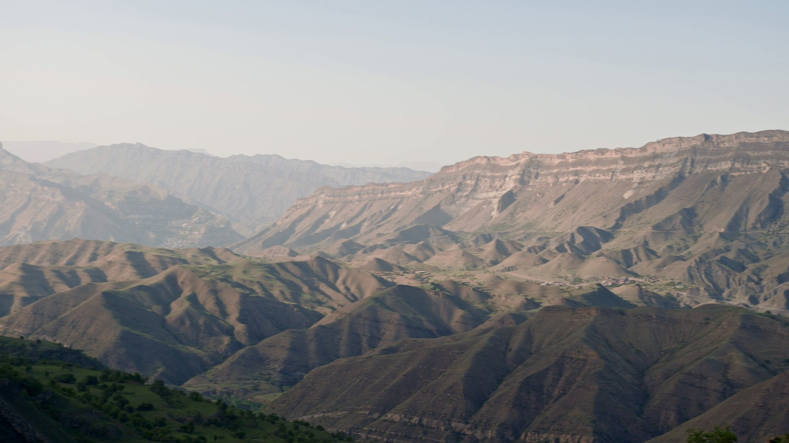

图源：cottonbro studio，[Camera Panning Over Mountains](https://www.pexels.com/video/camera-panning-over-mountains-9943097/)，Pexels License。此图是视频实拍帧的裁剪、校色与缩放派生版本，不是生成图。

这就是 LAB 002 的主线：**先找到同一个地方，再决定谁覆盖谁。**前半句解决对齐，后半句解决融合和裁剪。

## 01｜同一个地方，怎样被程序认出来

第一步不是直接处理千万级像素，而是把照片缩到适合分析的尺寸，再寻找局部特征。当前实现用 ORB 在灰度图上挑出最多 2500 个关键点，为每个点生成二进制描述子。山脊转折、云层边缘、建筑轮廓通常比大片纯色更容易留下稳定线索。

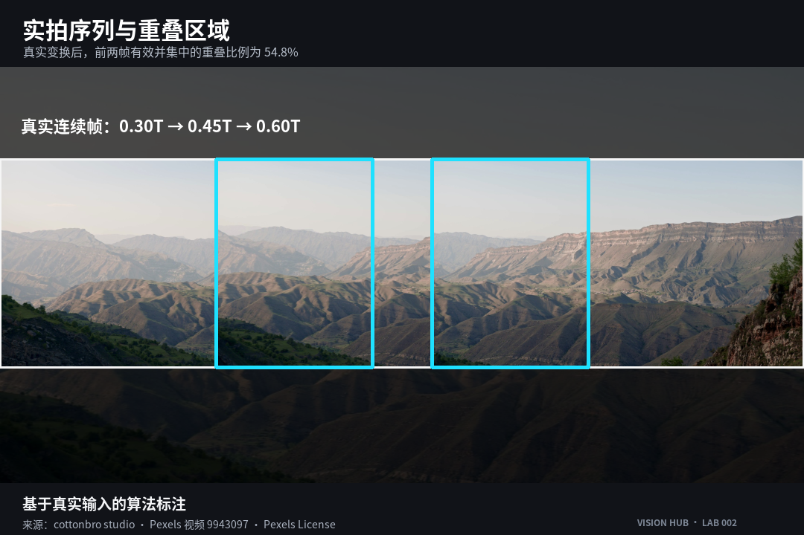

图 01—02：基于真实输入的算法标注。底图作者 cottonbro studio，Pexels 视频 9943097，Pexels License。

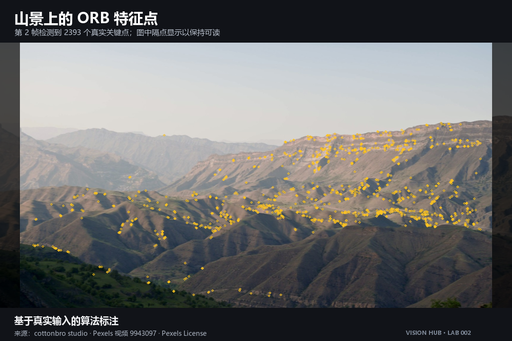

两张相邻照片各自有了描述子，接下来才是“配对”。BF-Hamming 会为一个描述子寻找距离最近的候选，但最近不代表可信：重复的树林、窗格或波纹，可能同时给出几个相似答案。

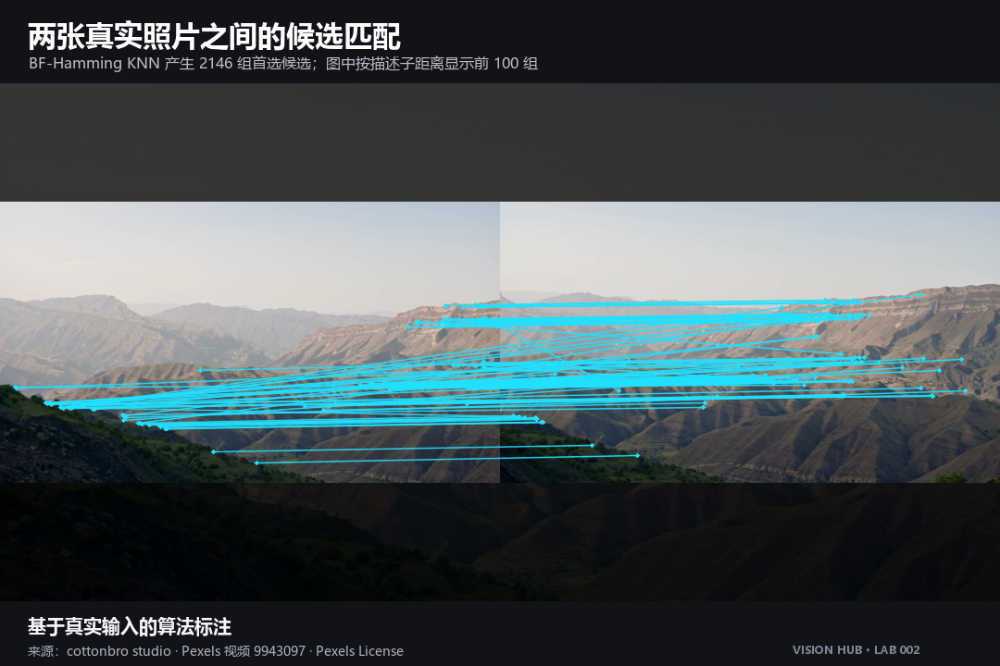

图 03：基于真实输入的算法标注。底图作者 cottonbro studio，Pexels 视频 9943097，Pexels License。

项目先做 0.75 比率筛选：最优候选必须明显优于第二候选；再做双向一致性检查，只有 A 选中 B、B 也选回 A 的匹配才留下。它不是为了让线条更整齐，而是在估计变换前删掉含糊关系。

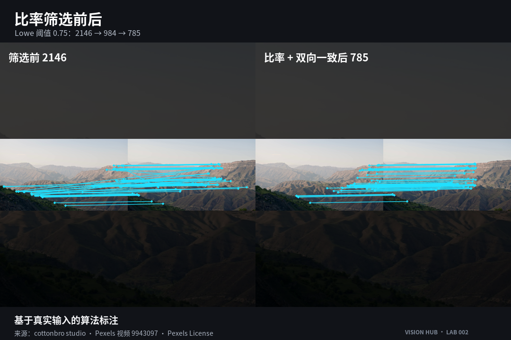

图 04：基于真实输入的算法标注。底图作者 cottonbro studio，Pexels 视频 9943097，Pexels License。

剩余匹配仍可能出错。RANSAC 会反复抽取小组对应点，寻找能解释最多匹配的单应性；符合模型的是内点，偏离的是离群点。当前版本还检查内点数量、内点率、中位重投影误差、变换稳定性和变换后的边界。于是失败不再只是“拼不上”，而会落到具体照片对和固定错误码。

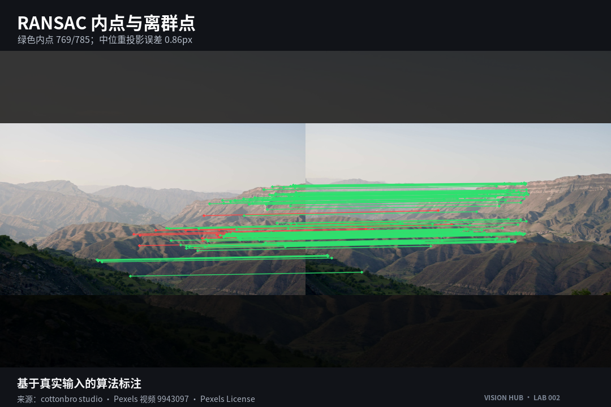

图 05：基于真实输入的算法标注。底图作者 cottonbro studio，Pexels 视频 9943097，Pexels License。

## 02｜对齐以后，谁来覆盖重叠处

三张照片不能都向最左边靠，否则误差会一路累积。LAB 002 选择序列中间图作为锚点，向左右累计相邻变换，再计算所有照片变换后的有效范围。这个范围决定全景画布需要多大，也决定手机内存预算能否承受。

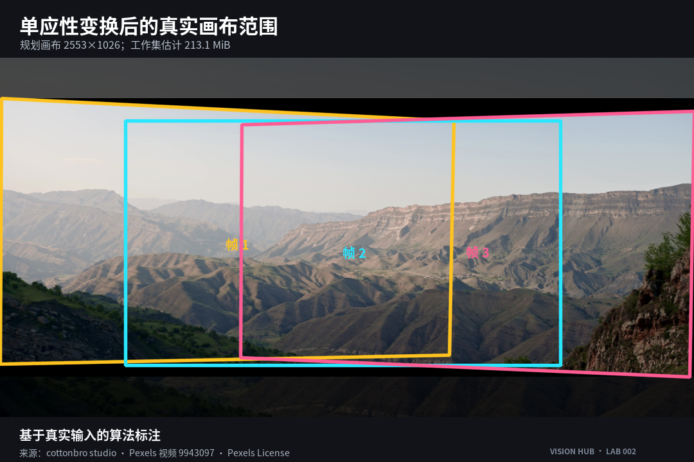

图 06—07：基于真实输入的算法标注。底图作者 cottonbro studio，Pexels 视频 9943097，Pexels License。

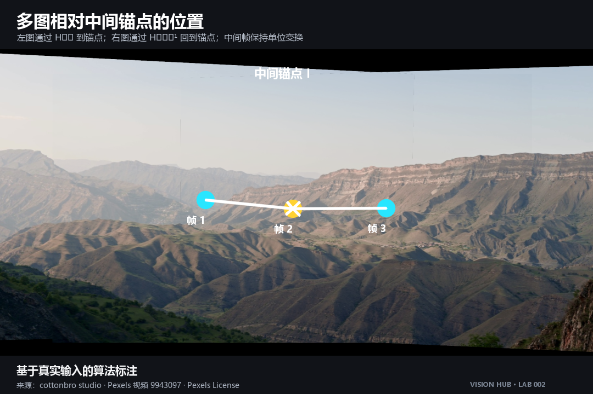

坐标对上了，接缝仍可能显眼。同一面山坡在两次曝光里会稍亮或稍暗，因此程序只在真实重叠区估计受限增益，并把范围夹在 0.7 到 1.3 之间。接着根据有效掩膜到边界的距离生成羽化权重，让一张图的贡献逐渐减弱，另一张逐渐增强。

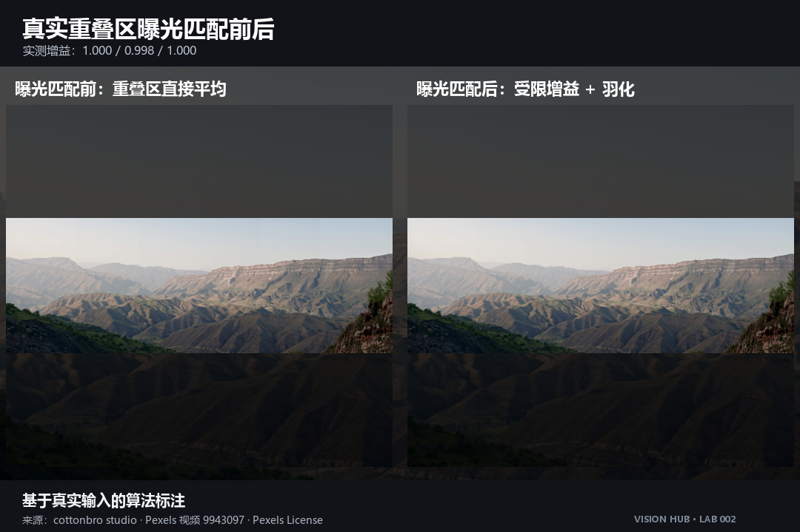

图 08—09：基于真实输入的算法标注。底图作者 cottonbro studio，Pexels 视频 9943097，Pexels License。

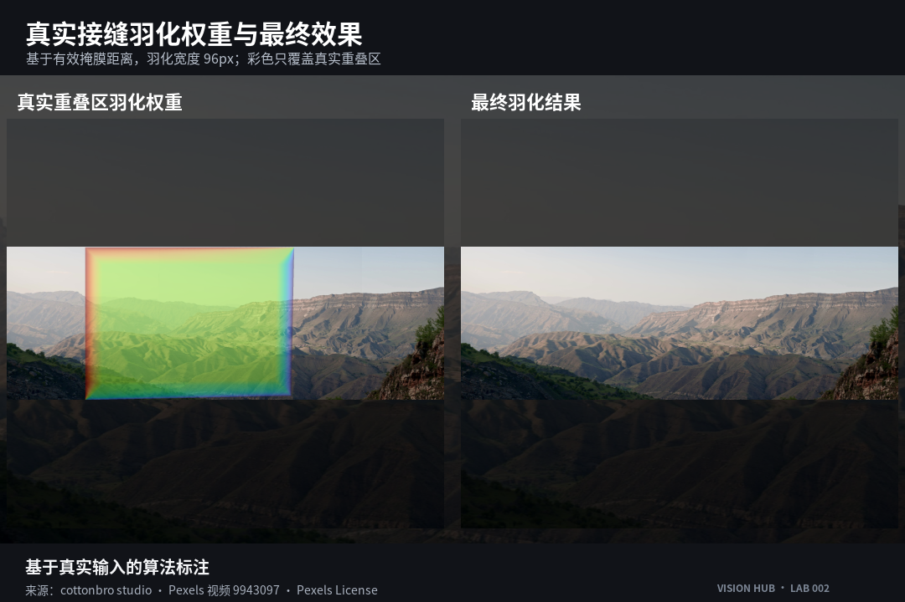

最后，程序从有效掩膜中寻找不含空洞的安全矩形，并向内收缩 2 像素。到这里，“谁覆盖谁”才真正结束：它包括曝光、权重、有效范围和裁剪，不是简单把两张图各设成一半透明。

## 03｜手机端只保留三步

Web 版把流程压成选择照片、确认顺序、拼接导出三步。相册入口支持多选；拍摄入口使用 `capture="environment"` 提示后置相机。MDN 同时提醒，这个属性在移动浏览器上的支持并不完全一致，所以页面保留普通相册入口，不能把“提示相机方向”写成“所有手机都会直接打开后摄”。

照片默认按选择或拍摄顺序，只匹配相邻项。顺序错了，可以在缩略图列表里调整；开始拼接后会显示处理阶段，也可以取消。完成后可查看接缝、微调裁剪并下载 JPEG，支持条件满足时再调用系统分享。

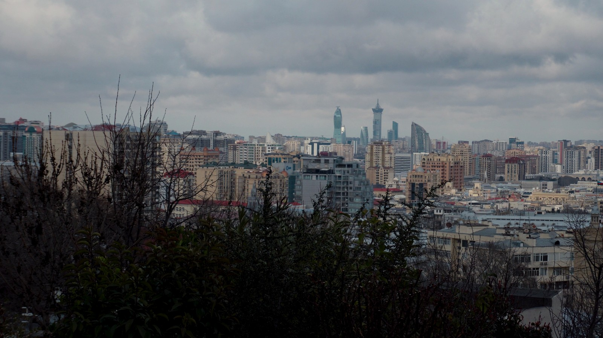

图源：Zulfugar Karimov，[Panoramic Cityscape of Modern Urban Skyline](https://www.pexels.com/video/panoramic-cityscape-of-modern-urban-skyline-36722864/)，Pexels License。城市序列用于四图验收，仍按选择顺序匹配相邻照片。

隐私边界也很明确：当前页面读取用户在本机选择的照片，并从同站点加载示例和 OpenCV 文件；应用代码与自动化检查中没有图片上传、远程处理、分析或第三方存储请求。

## 04｜失败时，先看哪一对照片

低纹理不等于必然失败。提交的完整三帧海面序列在本次真实诊断中成功拼接；但只截取海面区域做压力测试后，947 个候选只留下 **9 组**比率匹配，低于最少内点要求，程序返回 `INSUFFICIENT_OVERLAP`。

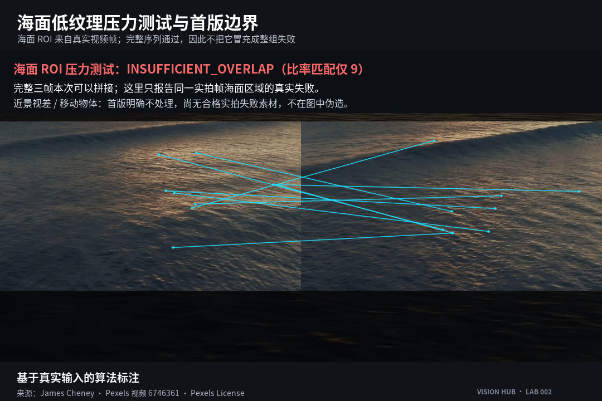

图 10：基于真实输入的算法标注。底图作者 James Cheney，[Panning Shot of Ocean](https://www.pexels.com/video/panning-shot-of-ocean-6746361/)，Pexels License。

这个结果只说明当前样例中的海面局部缺少足够独特的对应关系，不能外推为“海面一定拼不上”。更实用的动作是回到失败照片对：增加相邻重叠，保留远处轮廓或岸线，减少纯水面占比，再重新拍摄。

首版还有清楚的边界：不做圆柱或球面投影、束调整、多频段融合、自动全排序、移动物体去鬼影和 360 度闭环。近景视差与移动物体重影需要另外的真实拍摄来验证；本文没有相应图像证据，因此不拿示意图冒充现场结果。

## 05｜把它跑起来

Python 版可以直接接收两张以上照片：

```powershell
python -m panorama_stitch image1.jpg image2.jpg image3.jpg --output panorama.jpg
```

不传图片时会使用仓库内的真实山景序列。Web 版在线地址：

- [LAB 002 手机端全景拼接](https://hub-fover.github.io/Vision-Hu13/lab-002/)
- [GitHub 源码](https://github.com/hub-fover/Vision-Hu13)

发布状态：可发布。真实 Android Chrome 与 iPhone Safari 操作录屏仍标记为 `PENDING_DEVICE_CAPTURE`；在取得原生录屏、设备信息和摘要前，文章不插入模拟动图，也不拿自动化录像替代真机证据。

如果第一次拍摄只记一件事：让每张照片与下一张保留稳定、清晰、有纹理的重叠。算法需要的不是“差不多同一个方向”，而是能被反复认出的同一个地方。

---

素材许可：山景与图 01—09 底图作者为 cottonbro studio；城市帧作者为 Zulfugar Karimov；海面与图 10 底图作者为 James Cheney。三组素材均来自对应 Pexels 作品页并适用 [Pexels License](https://www.pexels.com/legal-pages/license/)。文章文字与原创算法标注排版采用 CC BY 4.0，第三方实拍内容不在该授权范围内。
