# LAB 003｜一张照片装不下的明暗，怎样用三次曝光合成？

> 一张照片容易顾此失彼。把暗处、正常区域和亮处各拍一张，程序就能从三张里挑出各自更可靠的部分。

副标题：不用专业模式：手机拍暗、正常、亮三张，网页本地合成曝光融合

## 先玩 30 秒：三张照片怎样合成

打开 LAB 003，先点「用样例体验」。页面会装入同一机位拍摄的三张照片：一张偏暗，一张正常，一张偏亮。点「开始融合」，几秒后就能在「融合结果」和「中间曝光」之间拖动比较。

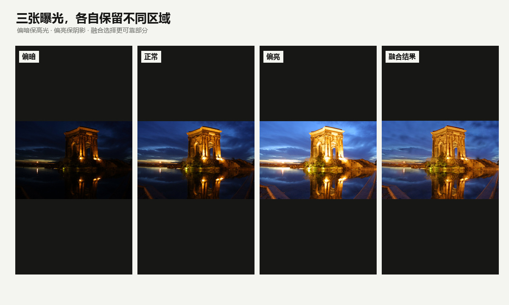

换成自己的照片也不需要专业相机 App。用手机原生相机依次拍三张，保持构图不变，再用系统亮度滑杆让画面明显变暗、恢复正常、明显变亮。网页会自动判断顺序，所以从相册选择时不必手工排序。

第一次尝试，优先选同时有亮处和暗处、主体基本静止、纹理清楚的场景：窗边人物、日落建筑、夜景建筑或灯牌、室内灯光下的静物都可以。先避开行人、车辆、快速摆动的树叶、水面，也避开大面积纯色墙面或天空，以及近距离前后景差异很大的场景。

拍照时用手机原生相机就够了。双手握稳，或把手机靠在栏杆、桌面上；三次拍摄保持机位、方向、焦段和变焦不变。依次拍一张偏暗、一张正常、一张偏亮，中间只用系统亮度滑杆改变画面明暗，不需要精确 EV。按下下一次快门前，等人物和主体重新稳定下来。

照片只留在当前页面内存中。没有上传接口，没有 Cookie，也不会写入浏览器 Storage。处理结束或关闭页面后，临时图像对象会被释放。

## 一张照片为什么装不下亮处和暗处

面对夜景建筑、窗边人物或逆光风景，传感器要同时接住很亮和很暗的部分。曝光偏亮，阴影看清了，灯和天空可能变成一片白；曝光偏暗，亮处保住了，暗部又沉成一团。

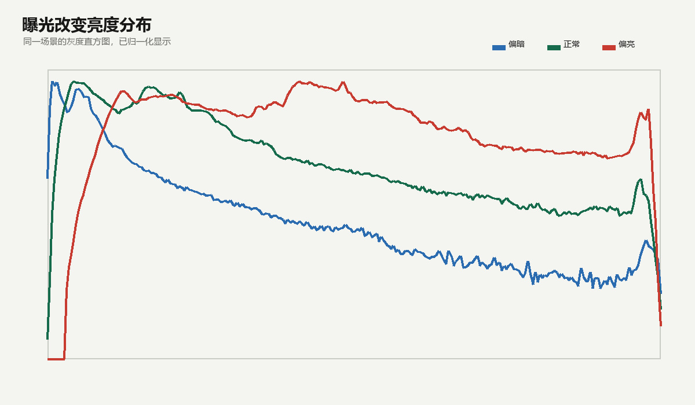

直方图把这种取舍画了出来：偏暗照片的像素更多落在左边，偏亮照片更多挪向右边。单张 JPEG 一旦把高光压到纯白，或者把暗部压到几乎纯黑，后期再拉滑杆也没有足够细节可用。三张照片的价值，是让同一块场景至少在某一张里处于较合适的亮度。

## 偏暗、正常、偏亮不需要精确 EV

这次实验只要求三张照片有清楚的相对亮度差，不要求你理解 EV，也不要求每次变化正好一档或两档。程序会计算每张图的相对亮度，再自动排成暗、中、亮。

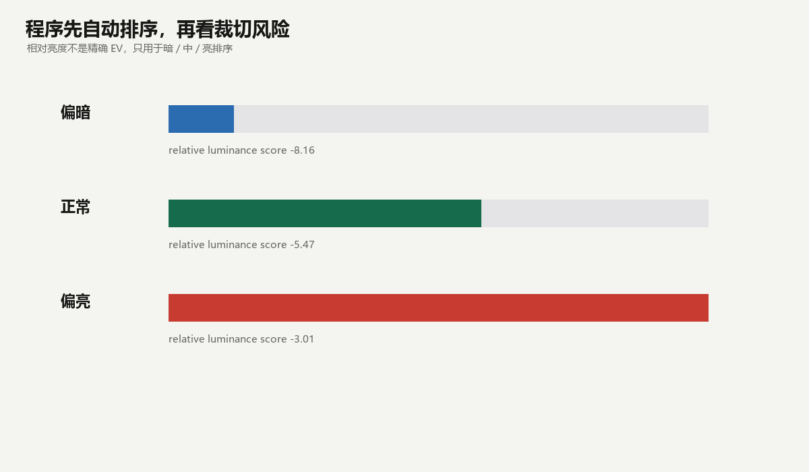

如果三张照片实在太像，程序会停止并提示补拍。原因很简单：输入几乎相同时，融合没有新的亮部或暗部信息可选，只会增加对齐成本。

## 程序怎样判断三张照片是不是同一场景

曝光不同会改变整张图的明暗，不能直接拿像素逐点相减。程序先把照片转成灰度图并均衡直方图，再寻找建筑边缘、纹理拐角等局部特征。只有三张图里能找到足够多、位置关系一致的特征，才继续融合。

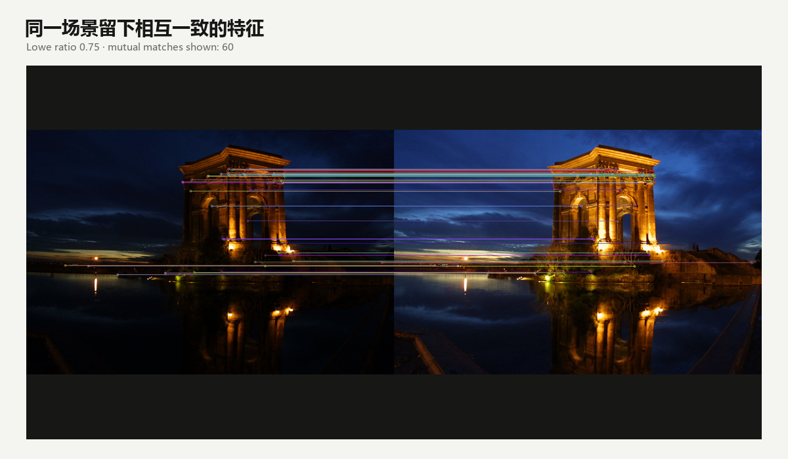

这道检查能拦住明显换了构图、转向另一个场景或纹理太少的输入。但它不是内容理解模型：重复窗格、大片纯色墙面、严重模糊仍可能让匹配变得困难。

## 轻微手抖怎样被对齐

手机连拍三张时很难完全不动。程序以中间曝光为参考，估计一组只包含平移、轻微旋转和轻微缩放的变换，把偏暗、偏亮两张拉回中间曝光的位置。

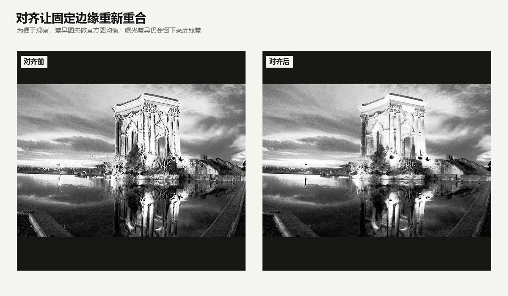

不是所有变换都会被接受。内点数量、内点比例、重投影误差、旋转、缩放和平移都设有质量门。超过范围时，与其硬合成出错位轮廓，不如直接请用户重拍。

## 融合时为什么要看对比度、饱和度和适曝度

对齐后，程序为每张图的每个位置计算三种分数。对比度偏好边缘和纹理清楚的区域；饱和度偏好颜色信息较完整的区域；适曝度偏好没有过暗或过亮的像素。

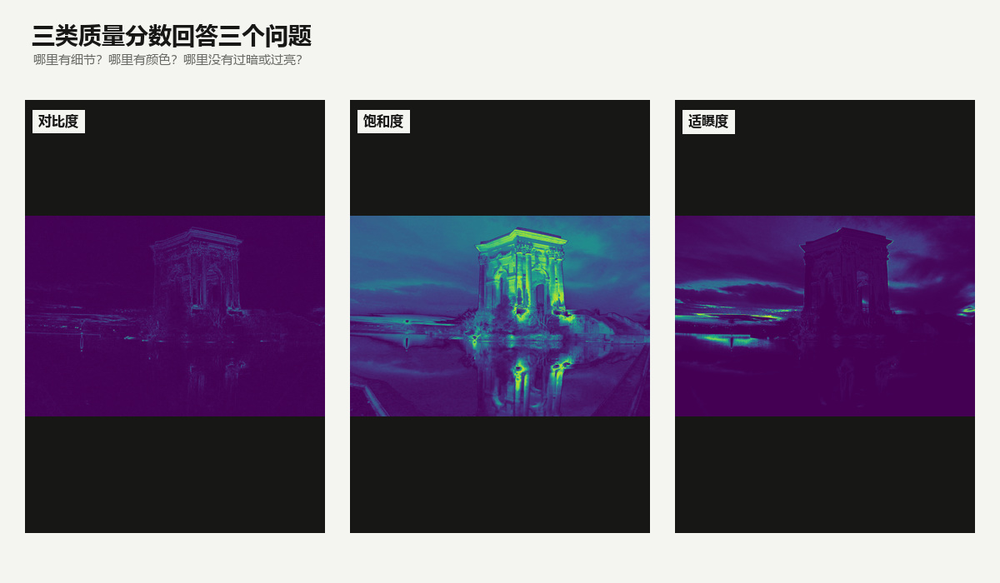

三种分数相乘后再在三张图之间归一化，得到每个位置的融合权重。它不是简单地把三张平均，也不是整块地选某一张，而是让不同位置根据自身质量分配来源。

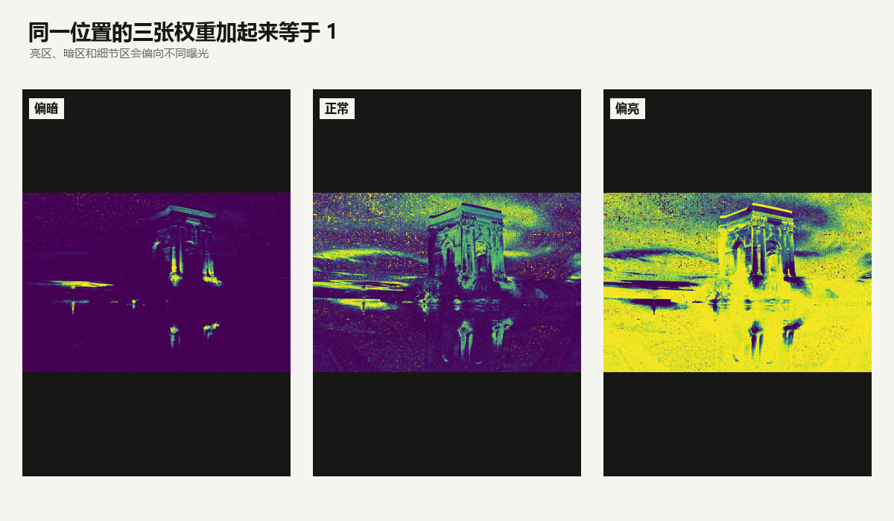

## 多尺度金字塔怎样避免接缝和光晕

如果直接按权重逐像素拼接，权重突然变化的位置容易出现接缝。Mertens 曝光融合会把图像拆成从细节到大轮廓的多层表示：细层处理纹理，粗层处理大范围亮度过渡。

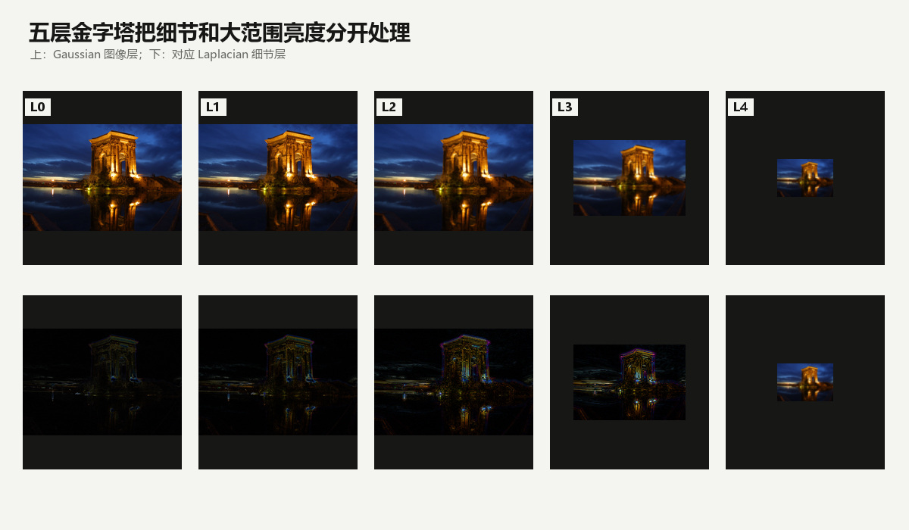

权重也会逐层变柔和。每一层分别融合，再从最小层逐级重建，就能让来源切换发生在合适的空间尺度上。它不能保证任何输入都没有光晕，但比单层拼接稳定得多。

## 运动保护为什么只能减少重影

三次曝光之间，树叶、水面、行人和车辆可能已经移动。程序会比较对齐后三帧的局部差异，把明显变化的位置标成运动区域，并在这些位置优先保留中间曝光。

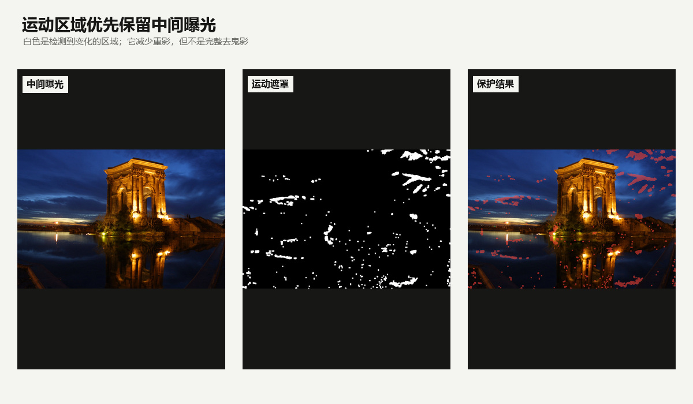

这是一种保守策略：它减少同一个人出现两三道轮廓的机会，却不会凭空恢复被遮挡的背景，也不能解决大面积水波、树叶或快速运动。运动太多时，最可靠的办法仍然是重拍。

## 它是曝光融合，不是绝对 HDR，也不是手机厂商管线

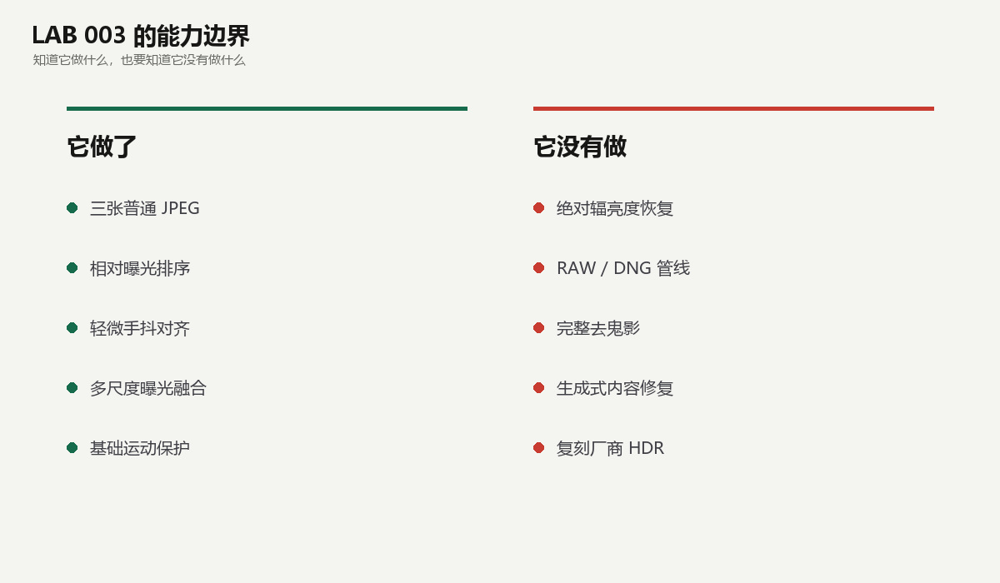

LAB 003 直接把三张普通照片融合成一张好看的 JPEG，没有根据曝光时间恢复场景的绝对辐亮度，也没有生成可供专业色调映射的 HDR 辐亮度图。

它更不是 Apple、Google 或其他手机厂商的内部 HDR 管线。厂商系统可能同时使用更多帧、传感器 RAW 数据、语义分割、光流、去噪和专用硬件。这个实验刻意只保留可解释、可在浏览器本地运行的一条教学管线。

边界说清楚后，它仍然很好用：普通手机、系统相机、三张 JPEG，就能亲手看见“从不同曝光里挑出更可靠部分”这件事是怎样发生的。

公众号里的外部链接可能失效，建议用手机扫描下方二维码打开 LAB 003。第一次使用可以先点“用样例体验”，确认设备能够运行后，再换成自己的三张照片。

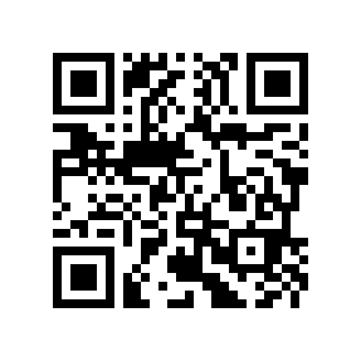

LAB 系列承诺：每一期都提供可以运行、可以检查、也会明确失败边界的计算机视觉实验。

我是 Vision Hu13，持续用可运行的实验拆解计算机视觉。

如果这次实验对你有帮助，欢迎点赞、在看、转发，我们下篇见。

END
